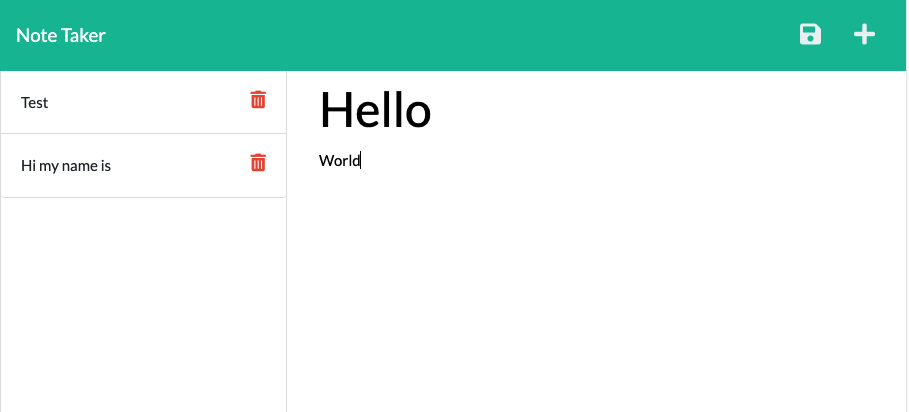

# Note_Taker

## Description

An application utlizing express.js that you can use to take down notes.

## Project Preview

## Link to deployed project

https://a-place-for-my-thoughts.herokuapp.com/notes

## Table of Contents

- [Description](#description)
- [Installation](#installation)
- [Usage](#usage)
- [License](#license)
- [Contributing](#contributing)
- [Tests](#tests)
- [Questions](#questions)

## Installation

Clone repository off of GitHub and install npm

## Usage

Go to heroku link.

## License

This application is covered by the MIT license.

## Contributing

Peter Vrutneski

## Tests

No

## Questions

Find me on GitHub: [Boopdid](https://github.com/Boopdid)

Email me with any questions: pvrutneski@gmail.com
